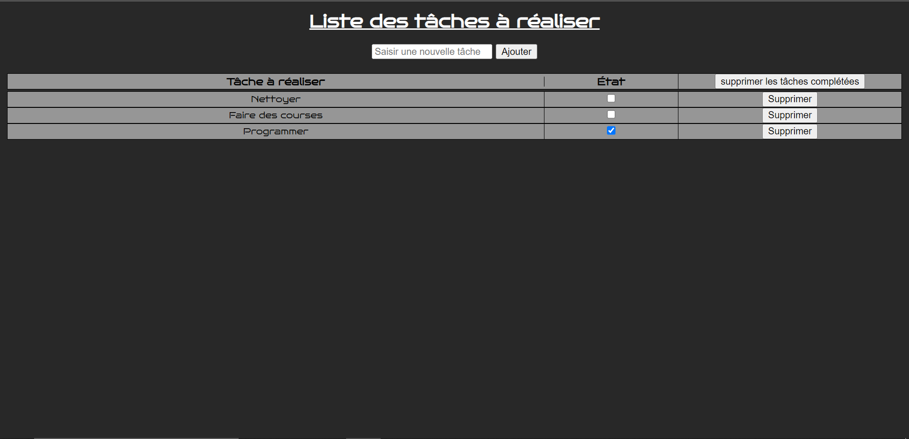

# Todo-list

## Description
a project containing a to-do list for adding to-dos, marking them as done, and deleting them (individually or all tasks marked as done).

## Made with

## Author
Your humble servant.

## Link
> https://leshib.github.io/todo-list/

## Rendering of the project

